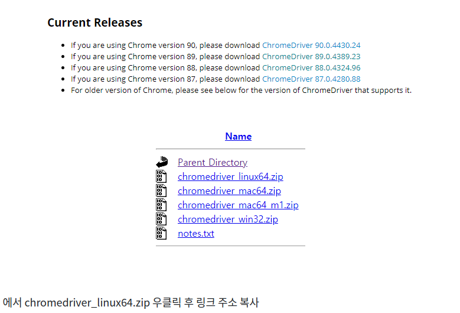

https://velog.io/@choi-yh/Ubuntu-20.04-selinium-%EC%84%B8%ED%8C%85

selenium을 사용할 경우 google-chrome과 chrome webdriver가 필요하다.
ubuntu 20.04 에 설치

google chrome 설치 
```
# 설치파일 받기
$ wget https://dl.google.com/linux/direct/google-chrome-stable_current_amd64.deb 

# 크롬 설치치
$ sudo apt install ./google-chrome-stable_current_amd64.deb 

# 크롬 버전 확인
$ google-chrome --version
```

chrome driver 설치

https://chromedriver.chromium.org/downloads 에서 chrome과 같은 버전 링크 접속
(89.0.4389.23 사용)




```
# 크롬 파일 받기
$ wget https://chromedriver.storage.googleapis.com/89.0.4389.23/chromedriver_linux64.zip

# 압축 해제 
unzip chromedriver_linux64.zip

설치가 끝나면 시스템 구성을 위해 크롬 드라이버를 이동 및 권한을 부여해주시면 됩니다.
$ sudo mv chromedriver /usr/bin/chromedriver
$ sudo chown root:root /usr/bin/chromedriver
$ sudo chmod +x /usr/bin/chromedriver
```